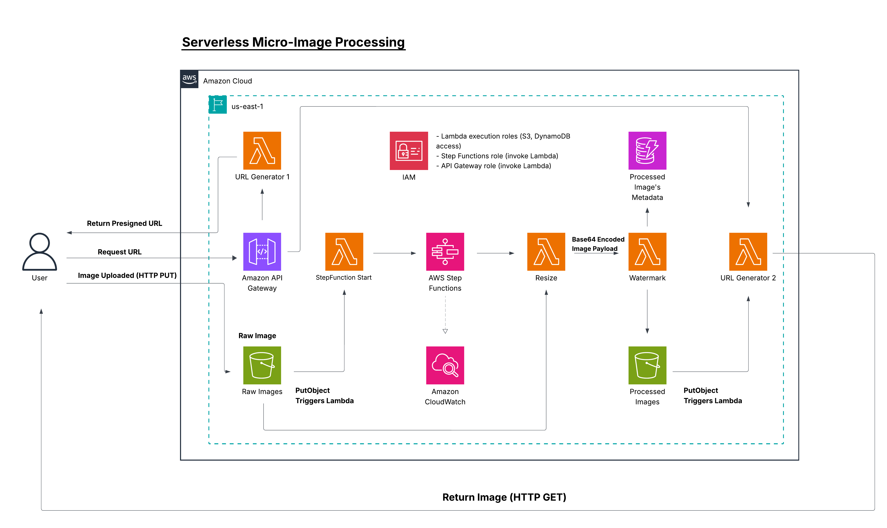

# 🖼️ Serverless Micro Image Processor

A fully serverless image processing pipeline on AWS. Upload an image, get back a resized and watermarked version — all without managing a single server.

---

## 🏗️ Architecture



---

## ⚙️ Tech Stack

| Layer | Technology |
|---|---|
| Compute | AWS Lambda |
| Orchestration | AWS Step Functions |
| Storage | Amazon S3 |
| API | AWS API Gateway |
| Image Processing | Python Pillow (via Lambda Layers) |
| Client | Bash |

---

## 🔄 Workflow

```
Client
  │
  ├─── 1. Request presigned upload URL  ──▶  API Gateway ──▶ Lambda
  │
  ├─── 2. Upload image directly ─────────▶  S3 (raw bucket)
  │                                               │
  │                                               ▼
  │                                     S3 Trigger ──▶ Lambda
  │                                                        │
  │                                                        ▼
  │                                             Step Functions
  │                                            ┌─────────────┐
  │                                            │  1. Resize  │
  │                                            │  2. Watermark│
  │                                            └─────────────┘
  │                                                        │
  │                                                        ▼
  └─── 3. Request presigned download URL ◀── S3 (processed bucket)
```

---

## 📁 Project Structure

```
image-processing-pipeline/
│
├── README.md
├── architecture.png
├── demo.mp4
│
├── lambdas/
│   ├── upload-url/
│   ├── resize/
│   ├── watermark/
│   └── return-image/
│
├── step-functions/
│   └── state-machine.json
│
├── scripts/
│   └── client.sh
│
└── docs/
    └── notes.md
```

---

## 🚀 How to Run

**1. Clone the repository**

```bash
git clone https://github.com/Ahmad-Hamdy-Elhendawy/Serverless-Micro-Image-Processor
cd image-processing-pipeline
```

**2. Make the client script executable**

```bash
chmod +x scripts/client.sh
```

**3. Run the script and enter your image path when prompted**

```bash
./scripts/client.sh
```

### Example Output

```
[OK] Upload successful
[INFO] Waiting for processing...
[OK] Processed image URL:
https://<processed-image-url>
```

---

## ✨ Key Features

- **Fully serverless** — no infrastructure to manage
- **Event-driven** — S3 triggers kick off processing automatically
- **Workflow orchestration** — Step Functions manage the resize → watermark pipeline
- **Secure file handling** — presigned URLs for both upload and download
- **External dependencies** — Python Pillow bundled via Lambda Layers
- **Decoupled and scalable** — each stage is independently deployable

---

## 🔮 Future Improvements

- [ ] Replace polling with event-based notifications (SQS/SNS)
- [ ] Use DynamoDB for job status tracking
- [ ] Add enhanced error handling (DLQ, retries, failure states)

---

## 📌 Outcome

This project demonstrates a complete serverless image processing pipeline on AWS, covering event-driven architecture, workflow orchestration, secure file handling, and the use of Lambda Layers for external dependencies.

